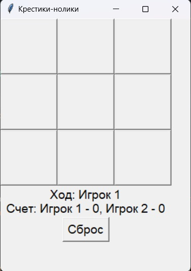

# __Krestiki-noliki2.0__
## I._Возможности игры:_
1.  Игра до трех побед;
2. При выигрыше (игра определяет победителя и объявляет его-Игрок №1 или Игрок №2, либо ничья);
3. Кнопка сброса игры.
_______________________________________________________________
## II._Снимок экрана:_


_______________________________________________________________
## III._Код игры:_
```
import tkinter as tk
from tkinter import messagebox

window = tk.Tk()
window.title("Крестики-нолики")
window.geometry("300x400")

current_player = "X"
buttons = []
player_choice = {"X": "Игрок 1", "O": "Игрок 2"}
scores = {"X": 0, "O": 0}
games_to_win = 3

def reset_game():
    global current_player
    current_player = "X"
    for row in buttons:
        for btn in row:
            btn.config(text="", state=tk.NORMAL)
    update_labels()

def check_winner():
    for i in range(3):
        if buttons[i][0]["text"] == buttons[i][1]["text"] == buttons[i][2]["text"] != "":
            return True
        if buttons[0][i]["text"] == buttons[1][i]["text"] == buttons[2][i]["text"] != "":
            return True
    if buttons[0][0]["text"] == buttons[1][1]["text"] == buttons[2][2]["text"] != "":
        return True
    if buttons[0][2]["text"] == buttons[1][1]["text"] == buttons[2][0]["text"] != "":
        return True
    return False

def check_draw():
    for row in buttons:
        for btn in row:
            if btn["text"] == "":
                return False
    return True

def on_click(row, col):
    global current_player
    if buttons[row][col]['text'] != "":
        return
    buttons[row][col]['text'] = current_player
    if check_winner():
        scores[current_player] += 1
        update_labels()
        if scores[current_player] == games_to_win:
            messagebox.showinfo("Игра окончена", f"{player_choice[current_player]} победил!")
            reset_scores()
        else:
            messagebox.showinfo("Игра окончена", f"{player_choice[current_player]} выиграл раунд!")
            reset_game()
    elif check_draw():
        messagebox.showinfo("Игра окончена", "Ничья!")
        reset_game()
    else:
        current_player = "O" if current_player == "X" else "X"
        update_labels()

def update_labels():
    label.config(text=f"Ход: {player_choice[current_player]}\nСчет: {player_choice['X']} - {scores['X']}, {player_choice['O']} - {scores['O']}")

def reset_scores():
    global scores
    scores = {"X": 0, "O": 0}
    reset_game()

label = tk.Label(window, text="", font=("Arial", 14))
label.grid(row=3, column=0, columnspan=3)

for i in range(3):
    row = []
    for j in range(3):
        btn = tk.Button(window, text="", font=("Arial", 20), width=5, height=2, command=lambda r=i, c=j: on_click(r, c))
        btn.grid(row=i, column=j)
        row.append(btn)
    buttons.append(row)

reset_button = tk.Button(window, text="Сброс", font=("Arial", 14), command=reset_scores)
reset_button.grid(row=4, column=0, columnspan=3)

update_labels()
window.mainloop()
```
